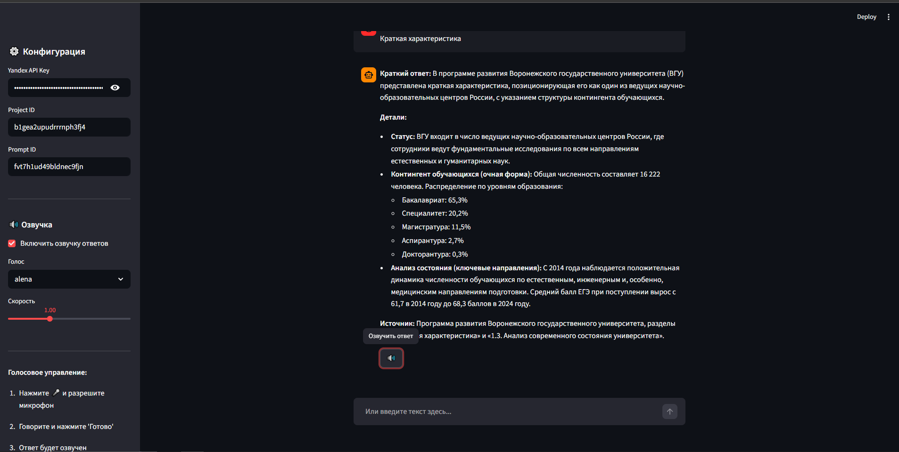

# 🔬 Научный RAG Ассистент

Простой и легкий клиент для общения с агентом на базе YandexGPT и Retrieval-Augmented Generation (RAG).
Позволяет задавать вопросы по предзагруженным документам (PDF, DOCX, веб-страницам) через промпт в Yandex Cloud.

## 🚀 Быстрый старт

### Локальный запуск

#### 1. Клонирование и установка

```bash
git clone <your-repo-url>
cd science_rag_agent

python -m venv venv
source venv/bin/activate  # для Linux/Mac
# или
venv\Scripts\activate     # для Windows

pip install -r requirements.txt
```

#### 2. Настройка ключей

Скопируйте шаблон и вставьте свои реальные данные:

```bash
cp .env.example .env
```

Отредактируйте `.env`:

```text
YANDEX_API_KEY=AQVN1_ВашСекретныйКлюч
YANDEX_PROJECT_ID=b1gea2upudrrrnph3fj4
PROMPT_ID=fvtu64r76l6l21dk0v8u
```

> **Примечание:** Вы также можете ввести ключ прямо в веб-интерфейсе приложения (в боковой панели), если не хотите создавать `.env` файл.

#### 3. Запуск

```bash
streamlit run app.py
```

Приложение будет доступно по адресу: http://localhost:8501

### Docker запуск

#### Сборка и запуск через Docker Compose

```bash
# Сборка образа и запуск
docker-compose up -d

# Просмотр логов
docker-compose logs -f

# Остановка
docker-compose down
```

#### Запуск только через Docker

```bash
# Сборка образа
docker build -t science-rag-assistant .

# Запуск контейнера
docker run -d \
  --name science-rag-assistant \
  -p 8501:8501 \
  --env-file .env \
  science-rag-assistant
```

## 🎤 Голосовые возможности

### Ввод речи (Speech-to-Text)

Для распознавания голосовых сообщений используется **Yandex SpeechKit STT**:

- **Формат:** Аудио записывается через встроенный компонент Streamlit `st.audio_input`
- **Отправка:** Аудио отправляется в Yandex Cloud для распознавания
- **Результат:** Распознанный текст автоматически подставляется в поле ввода
- **Язык:** Русский (поддерживаются и другие языки)

### Озвучка ответов (Text-to-Speech)

Для синтеза речи используется **Yandex SpeechKit TTS**:

- **Технология:** Нейросетевой синтез речи на основе WaveNet
- **Голоса:** 
  - `alena` — женский голос (по умолчанию)
  - `filipp` — мужской голос
  - `ermil` — мужской голос (нейтральный)
  - `jane` — женский голос (эмоциональный)
- **Настройки:** 
  - Скорость воспроизведения (0.5x - 2.0x)
  - Автоматическая озвучка новых ответов
  - Ручная озвучка через кнопку 🔊 для любого ответа

### Как это работает технически?

```text
1. Пользователь нажимает кнопку записи 🎤
2. Браузер записывает аудио через MediaRecorder API
3. Аудио отправляется в Yandex SpeechKit STT
4. Распознанный текст отправляется в RAG-агент (YandexGPT)
5. Агент ищет ответ в базе документов
6. Текст ответа отправляется в Yandex SpeechKit TTS
7. Синтезированное аудио воспроизводится в браузере
```

## 📦 Используемые технологии

| Технология | Назначение |
|------------|------------|
| **Streamlit** | Веб-интерфейс и управление состоянием |
| **OpenAI SDK** | Совместимость с API YandexGPT |
| **YandexGPT** | LLM для генерации ответов |
| **Yandex SpeechKit STT** | Распознавание речи (Speech-to-Text) |
| **Yandex SpeechKit TTS** | Синтез речи (Text-to-Speech) |
| **Yandex Vector Store** | Векторное хранилище документов |
| **Docker** | Контейнеризация приложения |

## 🔧 Как это работает?

1. Приложение подключается к Yandex Cloud API через OpenAI-совместимый интерфейс
2. Отправляет ваш вопрос (текстовый или голосовой) в **указанный Prompt ID**
3. Промпт содержит инструкции для RAG и ссылку на Vector Store с документами
4. YandexGPT ищет релевантные фрагменты в базе знаний
5. Генерирует ответ строго на основе найденных документов
6. Ответ отображается в чате и (опционально) озвучивается

## 🎛️ Настройки в боковой панели

### API Конфигурация
- **Yandex API Key** — ключ доступа к Yandex Cloud
- **Project ID** — идентификатор проекта
- **Prompt ID** — ID промпта с RAG-инструкциями

### Настройки озвучки
- **Включить озвучку** — автоматическое озвучивание новых ответов
- **Голос** — выбор из 4 предустановленных голосов
- **Скорость** — регулировка темпа речи от 0.5x до 2.0x

## 📝 Примеры использования

### Текстовый запрос
```text
Вы: Какие ключевые показатели развития у МГУ до 2030 года?
Ассистент: В программе развития МГУ определены следующие показатели...
```

### Голосовой запрос
1. Нажмите кнопку 🎤 "Запишите голосовое сообщение"
2. Произнесите вопрос (например: "Расскажи о программе развития ВГУ")
3. Дождитесь распознавания текста
4. Получите текстовый и голосовой ответ

## 🛠️ Структура проекта

```text
science_rag_agent/
├── .env.example          # Шаблон переменных окружения
├── .env                  # Реальные ключи (в .gitignore)
├── .gitignore            # Игнорируемые файлы Git
├── .dockerignore         # Игнорируемые файлы Docker
├── app.py                # Основное приложение Streamlit
├── requirements.txt      # Python зависимости
├── Dockerfile            # Инструкции сборки Docker образа
├── docker-compose.yml    # Конфигурация Docker Compose
└── README.md             # Документация
```


