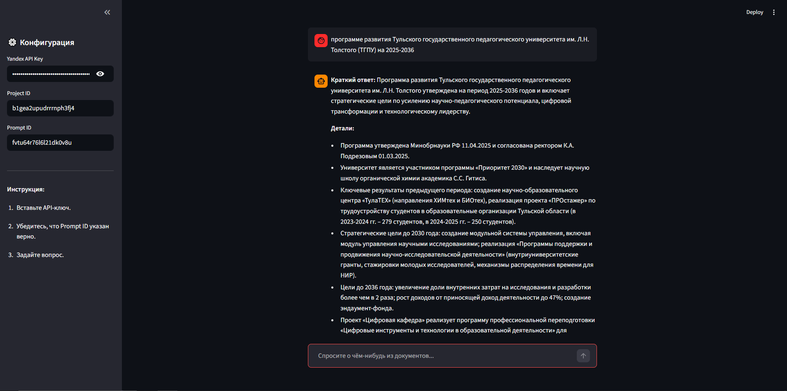

# 🔬 Научный RAG Ассистент

Простой и легкий клиент для общения с агентом на базе YandexGPT и Retrieval-Augmented Generation (RAG).
Позволяет задавать вопросы по предзагруженным документам (PDF, DOCX, веб-страницам) через промпт в Yandex Cloud.

## 🚀 Быстрый старт

### Локальный запуск

#### 1. Клонирование и установка

```bash
git clone <your-repo-url>
cd science_rag_agent

python -m venv venv
source venv/bin/activate  # для Linux/Mac
# или
venv\Scripts\activate     # для Windows

pip install -r requirements.txt
```

#### 2. Настройка ключей

Скопируйте шаблон и вставьте свои реальные данные:

```bash
cp .env.example .env
```

Отредактируйте `.env`:

```text
YANDEX_API_KEY=AQVN1_ВашСекретныйКлюч
YANDEX_PROJECT_ID=b1gea2upudrrrnph3fj4
PROMPT_ID=fvtu64r76l6l21dk0v8u
```

> **Примечание:** Вы также можете ввести ключ прямо в веб-интерфейсе приложения (в боковой панели), если не хотите создавать `.env` файл.

#### 3. Запуск

```bash
streamlit run app.py
```

### Docker запуск

#### Сборка и запуск через Docker Compose

```bash
# Сборка образа и запуск
docker-compose up -d

# Просмотр логов
docker-compose logs -f

# Остановка
docker-compose down
```

#### Запуск только через Docker

```bash
# Сборка образа
docker build -t science-rag-assistant .

# Запуск контейнера
docker run -d \
  --name science-rag-assistant \
  -p 8501:8501 \
  --env-file .env \
  science-rag-assistant
```

Приложение будет доступно по адресу: http://localhost:8501

## 📦 Используемые технологии

- **Streamlit** — для веб-интерфейса.
- **OpenAI SDK** — для совместимости с API YandexGPT (эндпоинт `responses.create`).
- **Yandex Cloud** — бэкенд LLM и RAG.
- **Docker** — для контейнеризации и легкого деплоя.

## 🔧 Как это работает?

1. Приложение подключается к Yandex Cloud API.
2. Отправляет ваш вопрос в **указанный Prompt ID**, который уже содержит все ваши документы (контекст RAG).
3. Возвращает сгенерированный ответ с опорой на загруженную базу знаний.


